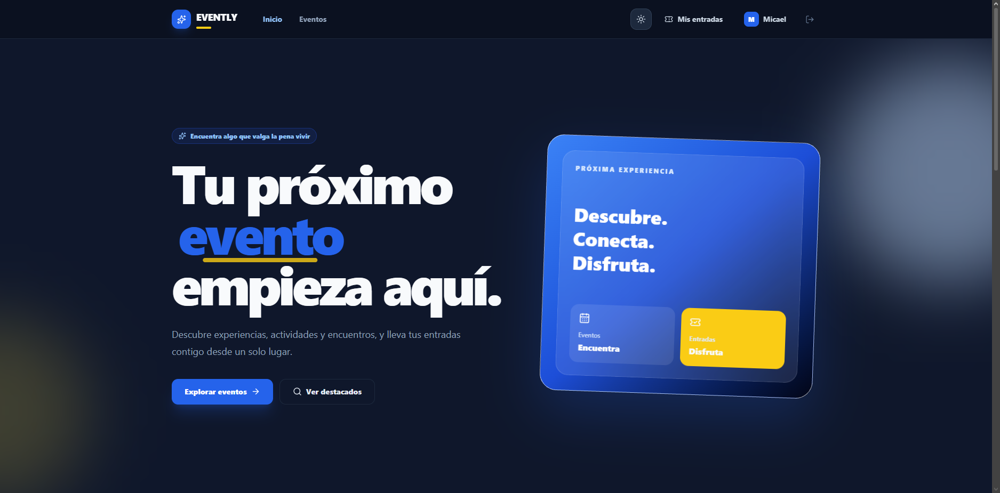

# 🌐 Evently – Frontend

**Evently** es una plataforma web para descubrir eventos, reservar entradas digitales y gestionar la asistencia mediante códigos QR.

El frontend fue desarrollado con **React + TypeScript**, con una interfaz moderna, responsive y compatible con modo claro y oscuro.

## 🚀 Demo

🔗 **Aplicación:**  
[Evently](https://eventlyfront.netlify.app)

## 📸 Vista del Proyecto

## ✨ Funcionalidades

- 🔐 Registro e inicio de sesión.
- 🔑 Recuperación de contraseña por correo electrónico.
- 🔎 Exploración y búsqueda de eventos.
- 🗂️ Filtros por categoría.
- 🎫 Reserva de entradas.
- 📱 Ticket digital con código QR.
- ❌ Cancelación de reservas.
- 👤 Sección de **Mis entradas**.
- 🧑‍💼 Panel para organizadores.
- 📅 Creación, edición, publicación y cancelación de eventos.
- 🖼️ Carga de imágenes para eventos.
- 👥 Consulta de asistentes.
- 📊 Estadísticas de reservas, ocupación y asistencia.
- 📷 Check-in mediante cámara y código QR.
- 🛡️ Panel administrativo.
- 🌗 Modo claro y oscuro.
- 📱 Diseño responsive para móvil, tablet y escritorio.

## 👥 Roles

### Usuario
Puede explorar eventos, reservar entradas y consultar sus tickets digitales.

### Organizador
Puede crear y administrar eventos, consultar asistentes, visualizar estadísticas y realizar check-in.

### Administrador
Puede gestionar usuarios, eventos y categorías de la plataforma.

## 🛠️ Tecnologías

- React
- TypeScript
- Vite
- Tailwind CSS
- React Router
- Axios
- React Hook Form
- Zod
- Motion
- QRCode React
- html5-qrcode

## 🔗 Backend

El frontend consume una API REST desarrollada con **ASP.NET Core**.

🔗 **API:**  
`Agregar aquí el enlace del backend cuando esté publicado`

---

© 2026 Evently. Todos los derechos reservados.

Hecho con ❤️ por **Adhoper**.
